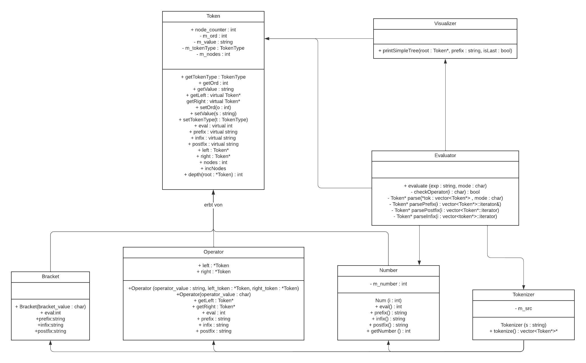

# ArithmeticTree
This repository contains a project developed as part of the IT-Automotive study at DHBW Stuttgart. It is a submission for the Algorithms and Complexity course.


## Disclaimer and Attribution
We would like to mention that we have developed this project entirely on our own. Any code or resources that were not developed by us have been appropriately marked as such and attributed to their original sources.


## Description

The ArithmeticTrees project focuses on parsing arithmetic expressions as binary trees in three different representations: prefix, infix, and postfix. The main objective is to build the arithmetic tree based on the input expression and evaluate its result, along with determining the number of nodes and the depth of the tree.


### Class Diagram

The project follows the following class diagram:




- `Token`: pure virtual class representing a token, which is either an operator, a bracket, or a number
   - `Operator`: represents an operator token, which is either `+`, `-`, `*`, or `/`
   - `Bracket`: represents a bracket token, which is either `(` or `)` 
   - `Number`: represents a number token, which is a positive integer
- `Evaluator`: evaluates the result of an arithmetic tree, by traversing the tree and calculating the result
- `Tokenizer`: parses an arithmetic expression into a vector of Token objects
- `Visualizer`: visualizes an arithmetic tree in the terminal, by printing the tree in a tree-like structure


### Features

- Parsing arithmetic expressions in prefix, infix, and postfix notation.
- Building binary trees from the parsed expressions.
- Evaluating the result of the arithmetic tree.
- Determining the number of nodes in the tree.
- Calculating the depth of the tree.
  

## Getting Started

### Prerequisites

- C++ compiler

### Installation

1. Clone the repository:

   ```bash
   git clone https://github.com/janniklth/ArithmeticTree.git

2. Compile the source code using a C++ compiler:

   ```bash
   g++ main.cpp -o executable

### Usage

1. Navigate to the project directory.

2. Run the compiled executable and enter an arithmetic expression and the given notation:

   ```bash
   ./executable -e <expression> -m <notation>
    ```
   - -m <notation>: Specifies the notation of the arithmetic expression. The <notation> can be one of the following:
     - `infix`: Indicates that the expression is in infix notation. 
     - `postfix`: Indicates that the expression is in postfix notation. 
     - `prefix`: Indicates that the expression is in prefix notation. 
   - -e <expression>: Specifies the arithmetic expression to be evaluated. The <expression> should be enclosed in parentheses to ensure correct parsing.

   Infix-Example: 

    ```bash
    ./executable -e (((2 + 112) + 24) * ((100 / 5) * 3))  -m infix
    ```


4. The program will parse the expression, build the arithmetic tree, and evaluate and visualize the result.


## Example

```c++
// Example code placeholder
```

## Development
We have utilized Git for version control, and as a result, specific version references are omitted in the class and method comments. The project has been developed collaboratively using pair programming techniques, which is why individual author attributions have been omitted.


## Contributing

Contributions to the ArithmeticTree project are welcome. If you find any issues or would like to suggest improvements, please open an issue or submit a pull request.

## License

This project is licensed under the MIT License. For more information, please see the [LICENSE](LICENSE) file.

## Contact

Thank you for checking out our project. We hope it is fun to experiment and helpful in expanding your knowledge of C++ and binary trees. If you have any questions, don't hesitate to contact ous.
